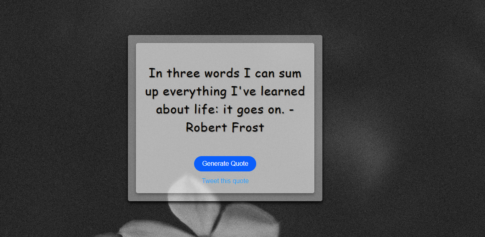

# Quote Generator

## Description

The Quote Generator is a simple web-based application that displays random quotes to the user. It provides motivational, inspirational, and humorous quotes to uplift and inspire the user. With just a click of a button, a new random quote is generated and displayed on the webpage.

## Features

- Random Quote Generation: The application has a collection of quotes stored in a data file. When the "Generate Quote" button is clicked, a random quote from the collection is displayed on the page.
- Responsive Design: The web application is designed to be mobile-friendly and responsive, ensuring it looks good on various devices, including desktops, tablets, and smartphones.
- Share on Twitter: Users can easily share the displayed quote on Twitter by clicking the "Tweet" button.

## Tech Stack

The Quote Generator is built using the following technologies:

- HTML/CSS: For building the user interface and styling the webpage.
- JavaScript: For random quote generation and handling user interactions.

## How to Use

1. Clone the repository to your local machine.
2. Open the `index.html` file in your web browser.
3. Click the "Generate Quote" button to display a random quote on the page.
4. To share the quote on Twitter, click the "Tweet this quote" button.

## Credits

The quotes used in this application are sourced from various authors and online collections. The credits for these quotes go to their respective authors.

## License

The Quote Generator is open-source and available under the [MIT License](LICENSE). You are free to use, modify, and distribute this project for personal and commercial purposes.

## Contribution

Contributions to this project are welcome. If you find any issues or have suggestions for improvements, feel free to create a pull request or open an issue.

---

Thank you for checking out the Quote Generator project! If you have any questions or feedback, feel free to contact us. Enjoy the quotes and get inspired!
